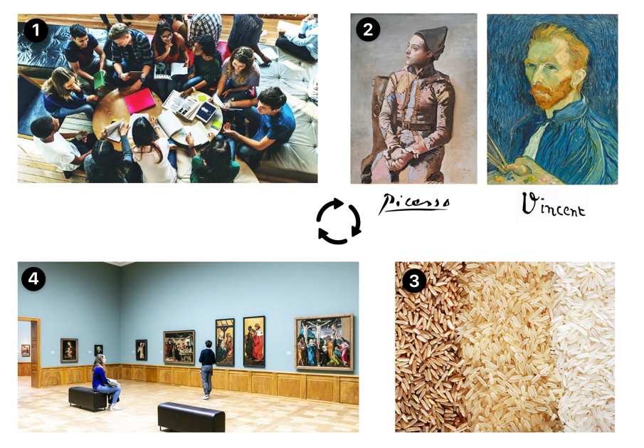

<!-- _class: big center -->

# ePortfolio
## Modul 431

---

---

<!-- _class: small-text emoji-list -->

# :question: Das ePortfolio

- :old_key: ist **Persönlich**, allenfalls teilöffentlich

- :books: ist eine **Wissenssammlung**
- :seedling: **wächst** mit Ihnen **mit**
- :hand: **begleitet** Sie ein Leben lang _- hoffentlich_
- :link: soll **Wissen verknüpfen**
- :factory: _sollte_ **portierbar/wiederverwendbar** sein

---

---

<!-- _class: small-text emoji-list -->

# :teacher: Prinzip

1. **Lernen**
    - :mortar_board: im Unterricht
    - :hammer: der Arbeit
    - :bath: im Leben 
1. Zusätzliches **Material sammeln** :mag:
    - :monocle_face: **Quellenangaben** nicht vergessen!
1. Material sichten, **auswerten** :eyes:

1. Im ePortfolio **kuratieren** :art:

---

<!-- _class: small-text -->

# :brain: Reflexion

- Was sind die **gelösten Probleme?**

- Könnten **evt. neue Probleme** entstehen?
- Gibt es **alternative Möglichkeiten?**
- Können **Verbindungen zu anderen Themen** gezogen werden?
- Gibt es einen **Bezug zum Berufsalltag?**
- Wäre das gelernte in der Vergangenheit hilfreich gewesen?
    - Wenn ja, wobei und warum?

---

# :toolbox: Tools im Web

::: columns

## Google Sites

- [Google Sites](https://sites.google.com)
- [Google Sites Dokumentation](https://support.google.com/sites/answer/6372878?hl=de)

::: split

## Microsoft OneNote

- [Microsoft OneNote](https://onenote.com)
- [Microsoft OneNote Trainings](https://support.microsoft.com/en-us/office/onenote-video-training-1c983b65-42f6-42c1-ab61-235aae5d0115)

:::

---

<!-- _class: emoji-list -->

# :keyboard: In Code

**:point_up: Nur wenn Ihr euch sicher fühlt!**

-  [Github & Markdown](https://www.github.com)
    - [GitHub Markdown Cheetsheet](https://github.com/adam-p/markdown-here/wiki/Markdown-Cheatsheet)
    - [Docusaurus](https://docusaurus.io) (Die Modulwebseite ist damit gemacht!)
    -  [Jekyll](https://jekyllrb.com/) (Standard von Github)
-  [WordPress](https://wordpress.com/de/com-vs-org/) 

- :hand: HTML von Hand _(nicht zu empfehlen wegen Aufwand)_

---

::: columns

# :pencil: Notiz

- Spontane Wissensablage

- In der Regel **keine Reflexionen** über ihren Inhalt

::: split

## **ePortfolio**

- Qualitative Wissensablage

- **Beinhaltet Reflexionen** über das Thema!

:::

---

::: columns

# :file_folder: Dateiablage

- **Ungefilterte** Ablage
- Beinhaltet Wichtiges wie **auch Unwichtiges**
- Strukturiert durch Ordner
- Querverbindungen nicht gut möglich

::: split

## **ePortfolio**

- **Sorgfältig Ausgewählte** Inhalte
- **Erfolge/Misserfolge** dokumentiert
    - Auch aus Fehler lernt man
    - Reflexion
- Strukturiert **Navigierbar**
- **Verlinken** von Inhalten

:::

---

::: columns

# :calendar: Lernjournal

- **Zeitlich** gegliedert
- Dokumentiert den **Lernprozess**
- **Selbstreflexion** beim Lernen
- Das Lernjournal kann ein **Unterpunkt vom ePortfolio** sein

::: split

## **ePortfolio**

- **Inhaltlich** gegliedert
- Dokumentiert die **Inhalte**
- **Themen Reflexion**
- Enthält **verweise zum Lernjournal**  

:::

---

# **:rotating_light: Auf das muss speziell geachtet werden!**

- **Alle Themen** finden sich wieder
- Das Portfolio enthält **Bezüge zu Ihrer Berufspraxis**
- Können Sie einzelne **Elemente aus Ihrem Berufsleben** einsetzen?
  - Wenn nicht, warum nicht?
- Die Themen werden untereinander **verknüpft**
- Eigene **Reflexion pro Thema**
- Es existiert ein **Gesamtfazit/Gesamtreflexion**
- Das **Lernjournal** kann integriert werden
- **Sinnvoll** gegliedert / **übersichtlich** dargestellt / **lesefreundlich**

---

<!-- _class: emoji-list -->

::: columns

# **Starten Sie jetzt**

1. Das Tool auswählen

1. Probieren Sie es aus
1. Machen Sie den ersten Eintrag
    - :arrow_right: _z.B. Handlungskompetenz_

 

- :information_desk_person:  **Wenn Sie heute noch nicht fertig werden ist das kein Problem!**

::: split

# <!-- fit --> :rocket:

:::
