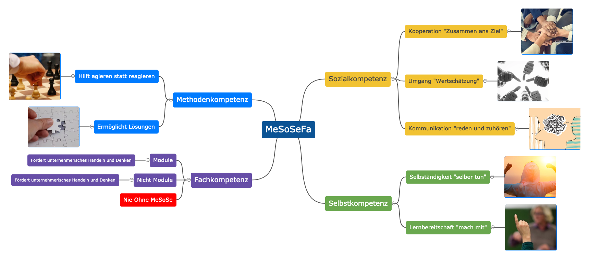

<!-- _class: big -->

# Modul 431
# <!--fit--> Handlungskompetenz

### Lukas Hodel

---

<!-- _class: big -->

# Handlung

Das **bewusste** ausführen einer Tat [1](#17)

---

# Kompetenz [2](#17)

**Sachverstand; Fähigkeiten**

Fertigkeiten, Fähigkeiten, Eigenschaften oder Haltungen, die es ermöglichen, Anforderungen in komplexen Situationen erfolgreich und effiziert zu bewältigen

 

### Fertigkeit [3](#17)

1. bei der Ausführung bestimmter Tätigkeiten **erworbene Geschicklichkeit**; Routine, Technik
1. Kenntnisse, Fähigkeiten

### Fähigkeit [4](#17)

1. geistige, praktische Anlage (6), die zu etwas befähigt; Wissen, Können, Tüchtigkeit
1. das Imstandesein, In-der-Lage-Sein, das Befähigtsein zu etwas, Vermögen, etwas zu tun

> :point_up: angeboren als auch erworben

---

# Kompetenz [2](#17)

 

## Zuständigkeit

- das liegt außerhalb meiner Kompetenz
- Durch die **Qualifikation** erworben

## Qualifikation [5](#17)

- durch Ausbildung, Erfahrung o. Ä. erworbene Befähigung zu einer bestimmten [beruflichen] Tätigkeit
- Voraussetzung für eine bestimmte [berufliche] Tätigkeit (in Form von Zeugnissen, Nachweisen o. Ä.)

---

# Handlungskompetenz

- Die **Handlungskompetenz** beschreibt die Gesamtheit aller Kompetenzen und stellt die Verbindung zwischen **Wissen** und **Können** her
- Das **bewusste Ausführen** einer Tat oder eines Auftrags in einem Bereich (z.B. IT) **mit der entsprechenden Qualifikation** durch **angeborenes oder erworbenes Wissen und Können**
- Handlungskompetent ist, wer berufliche Aufgaben und Tätigkeiten eigeninitiativ, zielorientiert, fachgerecht und flexibel ausführt. [6](#17)

---

---

# Arbeitsauftrag :pencil:

Machen Sie sich zum Thema Handlungskompetenz eigene Notizen
 

 

- Welche Arbeitsmethoden kennen Sie?
- Was sind Ihre Stärken und Schwächen in Sozial- und Selbstkompetenz?
- Welche Fachkompetenz zum Thema Informatik besitzen Sie bereits?

- **Dauer:** 10 Minuten
- **Sozialform:** Einzelarbeit
- **Produkt / Informationen:**
  - Ihre Notizen für die Besprechung
  - Ihre Ergebnisse werden anschliessend im Plenum besprochen

---

# **Me**thodenkompetenz

Die **Methodenkompetenz** umfasst Fertigkeiten, Kenntnisse und vor allem die Beherrschung und Anwendung verschiedener **allgemein gebräuchlicher**, z.T. auch spezifischer Arbeitsmethoden und Techniken

---

# **Me**thodenkompetenz / **Beispiele**

| Kompetenz | Beschreibung |
| ----------- | ----------- |
| **Informationsmanagement** | Informations- und Recherchetechnik, Suchstrategien, Ermittlungstechnik |
| **Arbeitstechnik** | strukturieren, notieren, markieren, ordnen und ablegen, archivieren, Lern- und Prüfungsstrategien |
| **Beherrschung grundlegender Informationstechnologien** | PC-Grundkenntnisse, Internet, Office-Anwendungen |
| **Projektmanagement** | Konzeptions- und Planungstechnik, Zeitmanagement |
| **Kreativitätstechniken, Problemlösungstechnik** | Brainstorming, Cluster, Osborn-Checkliste |
| **Präsentationstechnik** | dokumentieren, darstellen, visualisieren |
| **Vortragstechnik** | vortragen, referieren |
| **Kommunikations- und Verhandlungstechnik** | Arbeiten im Team, Konflikte lösen |

---

# **Fa**chkompetenz

- Die Fachkompetenz ergibt sich im Wesentlichen aus der **Sachkenntnis (Wissen)** und Fertigkeiten, die für die Bewältigung **bestimmter fachlicher Aufgaben** notwendig sind
- Es sind aber je nach Tätigkeit unterschiedliche **überfachliche Kompetenzen erforderlich** (aus den Bereichen der Methoden-, Sozial- und Selbstkompetenz)

---

# **Fa**chkompetenz in eurer Ausbildung

- Modulunterricht gemäss Bidlungsplan
- Allgemein-bildender Unterricht (ABU)
- Allgemeine Berufskenntnisse
    - Mathematik
    - Physik
    - Chemie
    - Wirtschaft
    - Englisch

---

# **So**zialkompetenz

Zur Sozialkompetenz zählen **Fähigkeiten, Fertigkeiten und Haltungen**, die es ermöglichen, sich im **Umgang mit den Mitmenschen** sozial angemessen zu verhalten

---

# **So**zialkompetentes Verhalten

- Integration in ein Team und harmonische Zusammenarbeit, Hilfsbereitschaft
- Kooperation, Integration (sich einordnen können)
- Bewältigen von Konfliktsituationen
- Kritikbereitschaft, Offenheit
- Empathie (sich in andere Menschen hineinfühlen können), Sensibilität
- Gute Umgangsformen
- Networking (Beziehungsnetze knüpfen und pflegen), Fairness

---

# **Se**lbstkompetenz

Die **Selbstkompetenz** beschreibt die Gesamtheit der verhaltensrelevanten Persönlichkeitsmerkmale.

- Fertigkeiten
- Fähigkeiten
- Eigenschaften und Haltungen die den Umgang mit der eigenen Person betreffen

---

# **Se**lbstkompetenz / **Beispiele**

| Kompetenz | Beschreibung |
| ----------- | ----------- |
| **Selbstbewusstsein/Identität** | Verantwortungsbewusst, initiativ, motiviert, zielorientiert |
| **Urteils- und Entscheidungsfähigkeit** | analysieren/beurteilen, entscheiden, Prioritäten setzen |
| **Konzentrationsfähigkeit** | Fähigkeiten/Energien bündeln |
| **Denkfähigkeit** | analytisches Vorgehen, problemlösendes Denken, logisch-strukturiertes und vernetztes Denken, Vorstellungskraft |
| **Reflexions- und Lernfähigkeit** | Eigenwahrnehmung, Selbsteinschätzung, Selbstkritik, Lernberreitschaft |
| **Kreativität** | fantasievoll, ideenreich, flexibel |
| **Charaktereigenschaften** | zuverlässig, leistungsbereit, ausdauernd, belastbar |
| **Werthaltungen** | Grundwerte haben und leben (Ehrlichkeit, Gerechtigkeit, Wertschätzung, Toleranz, Ethik, usw.) |
| **Emotionale Kompetenz** | Umgang mit Emotionen, Einfühlungsvermögen, Frustrationstoleranz |
| **Gesundheitskompetenz** | Gesundheitsförderliche Lebensführung, körperliche Integrität, Ausgewogenheit in Lebensbereichen |

---
<!-- _class: big -->

# <!-- fit --> Kommunikation

---

# Quellen

1. [https://www.duden.de/rechtschreibung/Handlung](https://www.duden.de/rechtschreibung/Handlung)
1. [https://www.duden.de/rechtschreibung/Kompetenz](https://www.duden.de/rechtschreibung/Kompetenz)
1. [https://www.duden.de/rechtschreibung/Fertigkeit](https://www.duden.de/rechtschreibung/Fertigkeit)
1. [https://www.duden.de/rechtschreibung/Faehigkeit](https://www.duden.de/rechtschreibung/Faehigkeit)
1. [Youtube: Was ist eine Handlungskompetenz?](https://www.youtube.com/watch?v=JDiAzLe_pMM)

