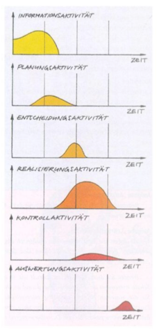

<!-- _class: big center -->

# IPERKA
## Modul 431

---

<!-- _class: no-float-link -->

# Modell der vollständigen Handlung 

::: columns

## Definition

> Es soll der Praxis im Berufsleben entsprechen und den Schülern ermöglichen, **handlungsorientiert** zu lernen um die erworbenen **Handlungskompetenzen** im späteren Berufsleben **selbständig** auf andere Arbeitsprozesse übertragen zu können.
> -- [Wikipedia](https://de.wikipedia.org/wiki/Modell_der_vollst%C3%A4ndigen_Handlung)

::: split

## Die sechs Stufen

1) Informieren
2) Planen
3) Entscheiden
4) Realisieren
5) Kontrollieren
6) Auswerten

:::

---

# Gemeinsames Brainstorming 

<!--  -->

<!-- TODO: neue Links!! -->

Folgende Links führen zu [AnswerGarden ](https://answergarden.ch)  Fragen

1. [Informieren ](https://answergarden.ch/3861608) 
1. [Planen ](https://answergarden.ch/3861609)
1. [Entscheiden ](https://answergarden.ch/3861611) 
1. [Realisieren ](https://answergarden.ch/3861612) 
1. [Kontrollieren ](https://answergarden.ch/3861613) 
1. [Auswerten ](https://answergarden.ch/3861614)

---

# Arbeitsauftrag 1 :pencil:

::: columns

Ordnen Sie die Fragen des folgenden Fragebogen den 6 Schritten zu:

[:link: Fragebogen](https://docs.google.com/spreadsheets/d/1nLLSKc_HXZzrvfeEwa79blUbbQoYpww23377OXSqYqk/edit#gid=0)

- Bitte macht eine **Kopie in ein eigenes Verzeichnis** und füllt die Fragen aus

::: split

- Dauer: **5 Minuten**
- Sozialform: **Einzelarbeit**
- Produkt: **Ausgefülltes Blatt**
- Informationen:
  - Besprechung im Plenum
  - Lösung wird nach der Lektion freigeschaltet

:::

---

# Arbeitsauftrag 2 :pencil:

::: columns

Sie erhalten von Ihrem Bildungs-verantwortlichen einen **Auftrag mit sehr wenigen Angaben**.

- Wie gehen Sie vor, wenn Sie **weitere Informationen benötigen** und den Bildungsverantwortlichen selber an diesem Tag nicht mehr fragen können?

::: split

- Dauer: **10 Minuten**
- Sozialform: **Partnerarbeit**
- Produkt: **Notizen vom Vorgehen**
- Informationen:
  - Besprechung im Plenum

:::

## 👉 Eintrag im ePortfolio unter IPERKA Reflexion!

---

# Vorgehen fürs ePortfolio

- Suchen Sie im Internet nach "IPERKA"

- Erläutern Sie im ePortfolio die 6 Schritte
- Verwenden Sie die gefundenen Quellen für Ihren ePortfolio Eintrag
- Reflexiren Sie inwiefern IPERKA im Berufsumfeld nützlich sein kann
  - Die Notizen vom IPERKA Arbeitsauftrag dürfen gerne mit einfliessen
