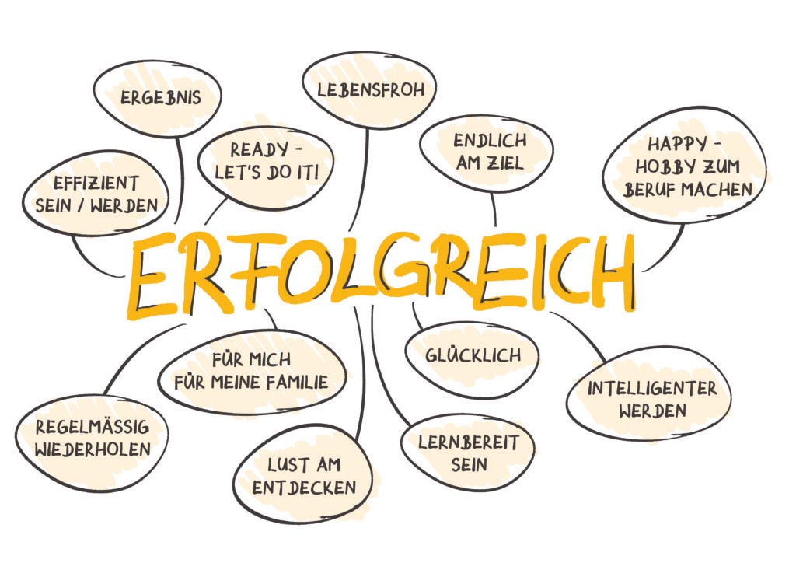

<!-- _class: big center -->

# Kreativitätstechniken
## Modul 431

---
# KAWA
## zu Kreativitätstechniken

::: footnotes

Quelle: [blog.brain-friendly.de](https://blog.brain-friendly.de/2020/10/die-2-erfolgreichsten-denkwerkzeuge-von-vera-f-birkenbihl-abc-listen-und-analograffiti/)

:::

---
# Kreativität

- **Fähigkeit**, neue **Lösungen** zu finden

- Angeboren und **Erlernbar!**

- **Kombination** von gelehrtem **Wissen**

  - Neugierde führt zu Wissen
  - Wissen erweitert Ihre Kreativität
  - Kreativität macht Freude :)

:::info 
:point_up: **Bilden Sie sich stetig weiter!**
:::

---

<!-- _class: big -->

>Entfernung und Unterschiede sind die geheime Zutat der Kreativität. Wenn wir nach Hause kommen, ist unser Zuhause immer noch dasselbe. Aber etwas in unserem **Kopf hat sich verändert, und das verändert alles**.
>-- Jonah Lehrer, Imagine! How creativity works

---

# Entspannung \*

- Das Hirn arbeitet immer
- Bei Entspannung werden weitere Regionen des Hirns aktiviert

- Neue Ideen werden so erst empfänglich!
- Es entstehen Geistesblitze
- **Warmduscher sind kreativ**

::: footnotes
\* Jonah Lehrer, Imagine! How creativity works
Bild von [eurovps.com](https://www.eurovps.com/blog/archimedes/)
:::

---

<!-- _class: big -->

> Kreativität ist das Überbleibsel verschwendeter Zeit
>-- Albert Einstein

---

# Intelligenz vs Kreativität

- Intelligenz != Kreativität \*

- Intelligenz != Wissen! \*

- **Wissen befähigt** **Kreativität** und **Intelligenz**

::: footnotes
Bild vom [Friedrich Verlag](https://www.friedrich-verlag.de)
\* `!=` bedeutet "nicht gleich" in allen Programmiersprachen
:::

---

# Kreativitätstechniken

Systematische **Anregung des kreativen Potenzials** einer Person oder Gruppe

- Viele neue **Ideen** 💡
- Ungeahnte **Visionen** 💫
- Spontane **Geistesblitze**💥
- Unkonventionelle **Lösungswege**

::: footnotes
Bild vom [Unternehmerlexikon](https://www.unternehmerlexikon.de)
:::

---

# Arbeitsauftrag  :pencil:

::: columns

Fast alle **Kreativitätstechniken** sind sowohl in Büchern als auch im Web ausführlich beschrieben.

Sie sind kostenlos und es gibt viele etablierte Methoden!

- **Suchen Sie eine im Internet** und bereiten Sie diese so auf, damit Sie sie anschliessend **im Plenum vorstellen** können.

::: split

- Dauer: **45 Minuten**
- Sozialform: **Einzel und Partnerarbeit**
- Methode: **Think, Pair, Share**
- Produkt: Ihre ausgewählte **Technik** zur Besprechung **visualisiert**
- **Informationen:**
  - Das Vorstellen soll nicht länger als **3 Minuten** dauern.
  - Besprechung im Plenum
  - **Direkt ins ePortfolio einfliessen lassen**

:::

---

# Arbeitsauftrag Vorschläge

- Brainstorming / Mind Mapping
- Brainwriting Pool
- 6-3-5 Methode
- Walt-Disney Methode
- Osborn-Checkliste
- 6 Denkhüte von De Bono
- etc.

## 👉 **Direkt ins ePortfolio einfliessen lassen!**

---
::: columns
- Think
Zeit: **10 min**
Sozialform: **Einzellarbeit**
Auftrag: **Denken Sie mal über ihr Kreativitätstechnik nach und Sammeln Sie Information.**

::: split

- Pair
Zeit: **15 min**
Sozialform: **Partnerarbeit**
Auftrag: **Tauschen Sie sich mit Ihrem/ Ihrer Partner/in aus und halten Sie das Ergebnis auf einem Flipchart fest.**

::: split

- Share
Zeit: **20 min**
Sozialform: **Plenum**
Auftrag: **Sie Präsentieren Ihr Ergebnis der Klasse.**

:::