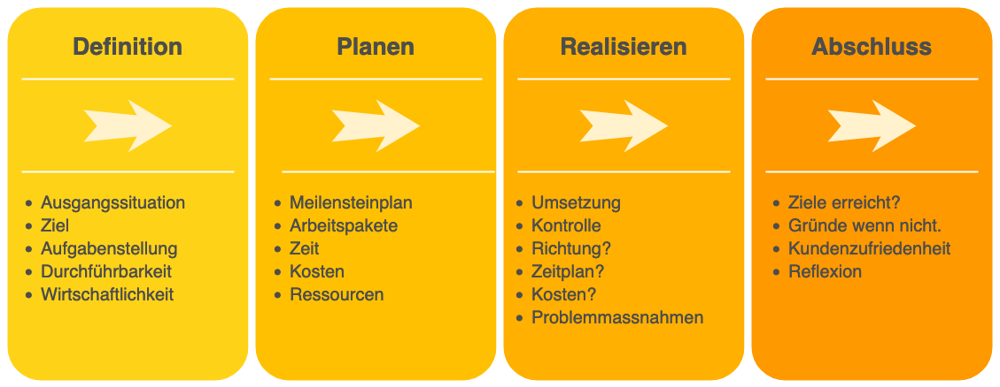
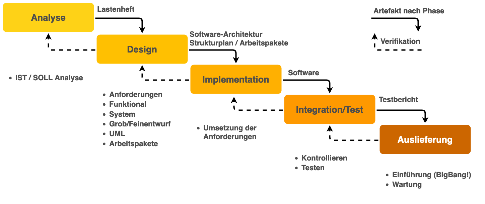
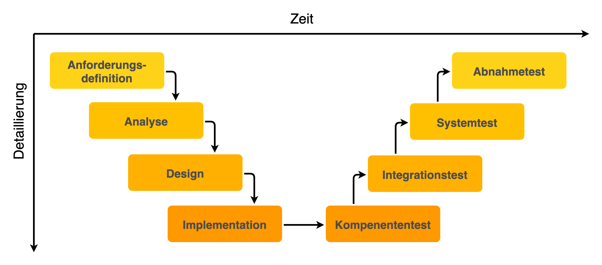
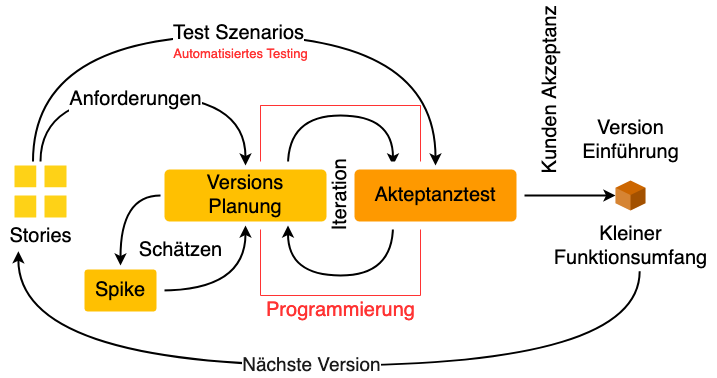
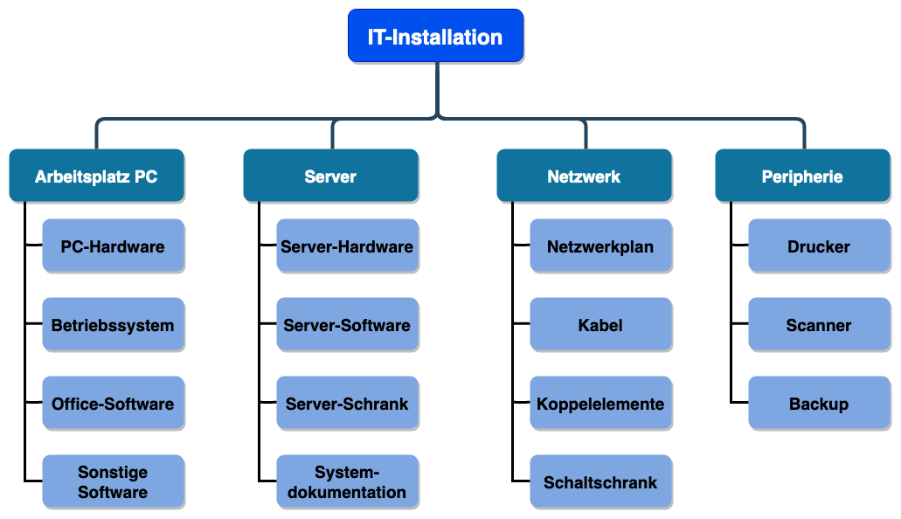
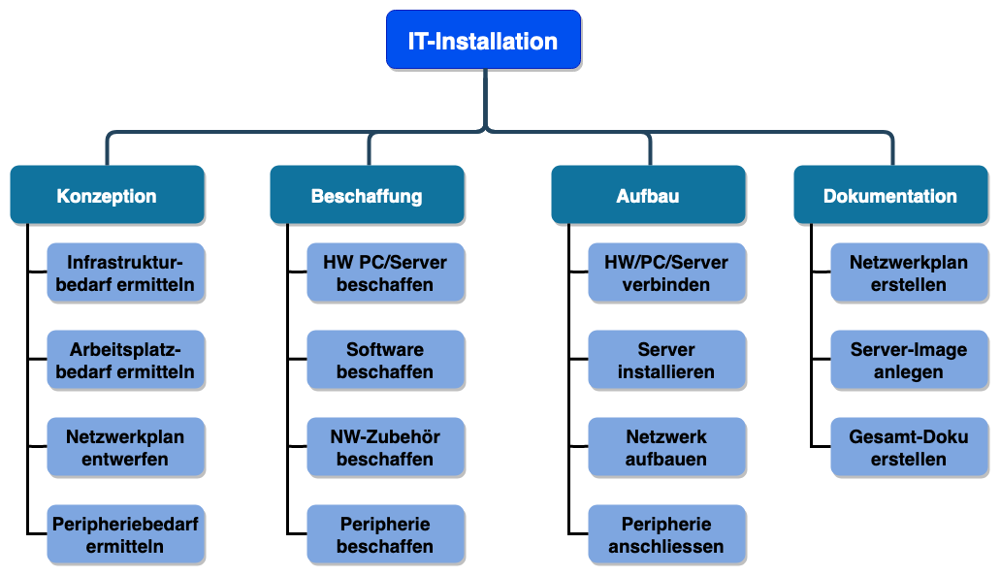
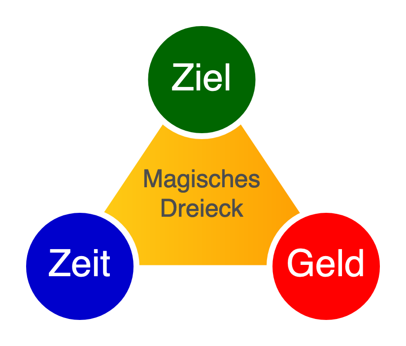
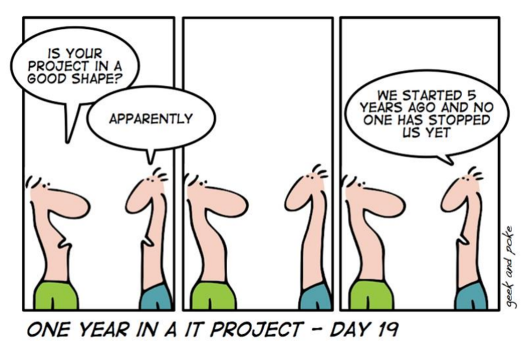

<!-- _class: big center -->

# Projektmanagement
## Modul 431

---

# Übersicht

- Was ist ein Projekt?
- Vorgehensmodelle

- Arbeitspakete
- Rollen
- Kongruenzprinzip
  - Aufgaben
  - Kompetenzen
  - Verantwortung

---

# :pencil: Arbeitsauftrag 1

::: columns s2

Sie wollen eine **Überraschungsparty** zum Geburtstag Ihres Vaters/Mutter oder Ihrer Schwester/Bruder mit 30-40 Gäste zu organisieren. Der Geburtstag ist **in 2 Monaten**.

- **Aufgabe Brainstorming:**
  - **Was ist in groben Zügen alles zu tun**, damit die Party ein voller Erfolg werden wird und das Geburtstagskind noch nach Jahren mit Freuden an das Fest zurückdenken wird?
  - **Welche Fragen** sind zu klären?
- **Anschliessend im Plenum:**
  - Welche Punkte werden angesprochen?

::: split

- Dauer:
  - **5 Min. Gruppenarbeit**
  - **10 Min. Besprechung**
- Sozialform:
  - **Kleingruppen (3-4 Personen)**
- Produkt / Informationen:
  - Ihre **Notizen** für die Besprechung
  - Ihre Ergebnisse werden anschliessend **im Plenum besprochen**

:::

<!-- 
Auftrag klären
Was darf es kosten?
Was ist das Motto?
Wer bezahlt?
Wer, wieviele soll eingeladen werden?
Wie muss der Ort erreicht werden können?
Können die Gäste zum Essen beitragen

Planen
Wo?
Wann, wie lange?
Welche Aktivitäten?
Wann muss was fertig sein?

Realisieren
Essen organisieren
Raum reservieren
Gäste eingeladen
Rechnungen bezahlen

Fest durchführen
Wer führt durch das Fest?
Wer ist für welche Spiele verantwortlich
Wer räumt auf?
-->

---

# :pencil: Arbeitsauftrag 2

::: columns s3

Lesen Sie die Projektdefinition gemäss der DIN (Deutsche Industrie-Norm) 69901 durch:

> Vorhaben, das im Wesentlichen durch die Einmaligkeit aber auch Konstante der Bedingungen in ihrer Gesamtheit gekennzeichnet ist, wie Z . B. Zielvorgabe, zeitliche, finanzielle, personelle und andere Begrenzungen; Abgrenzung gegenüber anderen Vorhaben; projektspezifische Organisation.
-- DIN 69901

- Erstellen Sie auf Grund dieser Definition und Ihrer **Recherchen im Internet** eine **Liste von Merkmalen** welche Projekte auszeichnen und beschreiben Sie jedes Merkmal mit Ihren Worten.

::: split

- **Dauer:**
  - 10 Minuten
- **Sozialform:**
  - 2er Teams
- **Produkt / Informationen:**
  - Internet verwenden
  - Tragen Sie die Informationen im **ePortfolio** zusammen.

:::

---

<!--

- Einmalig, neuartig

- Klare Zielvorgaben

- Zeitlich, personell und finanziell begrenzt

- Komplexität

- Fachübergreifend, Teamarbeit

-->

# Projektmerkmale

* **Einmalig, neuartig**

  - Ein Projekt wird zum ersten und zum letzten Mal durchgeführt

* **Klare Zielvorgaben**

  - Klare Vorgaben was mit dem Projekt erreicht werden soll

* **Zeitlich, personell und finanziell begrenzt**

  - Konkreter Anfang-/Endtermin und begrenztes Budget
  - Erfordert ausserordentlichen Aufwand der Mitarbeiter

---

# Projektmerkmale 2

- **Komplexität**

  - Die Lösung der Aufgabe beinhaltet eine gewisse Komplexität
  - Benötigt Fachwissen

* **Fachübergreifend, Teamarbeit**

  - Es werden Fachleute aus verschiedenen Bereichen gebraucht
  - Die Fachspezialisten müssen als Team zusammenarbeiten

<!--
- Einmalig, neuartig

- Klare Zielvorgaben

- Zeitlich, personell und finanziell begrenzt

- Komplexität

- Fachübergreifend, Teamarbeit
-->

---

<!-- _class: big center -->

# Reflexion Arbeitsauftrag 1

## Ist die Planung der Geburtstagsparty ein Projekt?

---

# Projekt Auslöser - von **Innen** getrieben

- Eigenen Geschäftsvorgang mit IT-Lösung unterstützen
- Schnellere Abwicklung
- Kosten Sparen
- Zusammenarbeit verbessern
- Besser, schneller billiger als die Konkurrenz
- Neuartiges Angebot lancieren

---

# Projekt Auslöser - von **Aussen** getrieben

- Kundenauftrag
- Alte Lösung wird nicht mehr unterstützt
- Neue Technologie bringt Chance zur Weiterentwicklung
- Gesetze die ändern

---

<!-- _class: big center -->

# Was wird gesteuert im Projekt?

---

# Was wird gesteuert im Projekt?

- **Prioritäten**
- Einsatz von **Geld**, **Ressourcen**
- Erfüllung gesetzlicher **Vorgaben**
- Sicherung der **Kundenzufriedenheit**

---

# :pencil: Arbeitsauftrag 3

::: columns

Welche der nachfolgend aufgeführten Vorhaben/Aktivitäten sind Projekte?

1. Verarbeitung von Kundenaufträgen
1. Bau eines neuen Hauses
1. Entwicklung einer neuen Software-Anwendung
1. Bearbeiten von Forderungen (Außenstände) und Verbindlichkeiten aus Lieferungen und Leistungen
1. Schaffung eines neuen Radiowerbespots
1. Ausführen der täglichen Auftragseingänge
1. Durchführung einer Bewertung der aktuellen Fertigungsprozesse
1. Reparaturen
1. Serviceleistungen

::: split

- Dauer:
  - **5 Minuten**
- Sozialform:
  - **Einzelarbeit**
- Produkt / Informationen:
  - **Notizen**
  - Besprechung im Plenum

:::

<!--
Projekte sind:
2, 3, 5, 7

Wenn grösser evt.:
8, 9
-->

---

<!-- _class: big center -->

# Vorgehensmodelle **Mit Planung ans Ziel**

---

# Vierphasenmodell1

::: footnotes

1. https://www.iww.de/bbp/archiv/projektmanagement-die-vier-schritt-technik-zum-erfolg-f24029

:::
---

# Wasserfall Modell2

  
::: footnotes
2. [Wikipedia | Wasserfallmodell](https://de.wikipedia.org/wiki/Wasserfallmodell), [Youtube](https://www.youtube.com/watch?v=3fExZRwj2bU)
:::

---

# V-Modell10

::: footnotes 
10. [Wikipedia | V-Modell](https://de.wikipedia.org/wiki/V-Modell)
:::

---

<!-- _class: big -->

> In software, we rarely have meaningful requirements. Even if we do, the only measure of success that matters is whether our solution solves the **customer's shifting idea of what their problem is**.
-- [Jeff Atwood](https://blog.codinghorror.com/), Gründer von [StackOverflow](https://stackoverflow.com/)

---

<!-- _class: big -->

> Wenn Du merkst, dass Du ein totes Pferd reitest, Steig ab!
-- Dakota-Indianer, [Liste von gängigen Massnahmen](http://www.roland-schaefer.de/totespferd.htm)

---

# Agile Methoden9

- Von großer Beweglichkeit zeugend; regsam und wendig

## Inkrementell / Iterativ

- schrittweise erfolgend, aufeinander aufbauend
- sich schrittweise in wiederholten Rechengängen der exakten Lösung annähernd

::: footnotes
9. Duden | [agil](https://www.duden.de/rechtschreibung/agil), [iterativ](https://www.duden.de/rechtschreibung/iterativ), [inkrementell](https://www.duden.de/rechtschreibung/inkrementell)
:::

---

# Spiralmodell3

::: footnotes left
3. [Wikipedia | Spiralmodell](https://de.wikipedia.org/wiki/Spiralmodell)
:::

---

# Extreme Programming4

::: footnotes
4. [Wikipedia | Extreme Programming](https://de.wikipedia.org/wiki/Extreme_Programming), [digite.com](https://www.digite.com/agile/extreme-programming-xp/)
:::

---

# SCRUM5

::: footnotes
5. [Wikipedia | SCRUM](https://de.wikipedia.org/wiki/Scrum), [Marketinginstitut.biz](https://www.marketinginstitut.biz/blog/scrum/), [Youtube](https://www.youtube.com/watch?v=Ibz9STVjtzI)
:::

---

# Agil heisst...

**den Plan** während dem Projekt **stetig** zu **erarbeiten** und **priorisieren**

- **Kundennutzen** (bewegliches Ziel)
- **Kundenzufriedenheit** (Vertrauen)

# **und nicht...**

- keinen Plan haben!
- keine Struktur haben!

---

# :pencil: Jetzt seit Ihr dran

::: columns s2

Sie werden ein Vorgehensmodell zugeteilt bekommen. Lesen Sie den Auszug aus dem Buch [Projektmanagement für IT-Projekte :link:](https://drive.google.com/file/d/102o8_oAEYr34mR5LTSrJZsVDFaEXUwzX/view). 

Finden Sie selber zusätzliche Informationen zu «Ihrem» Vorgehensmodell. Fassen Sie dies **auf einer einzigen Seite** grafisch zusammen.

- Darstellung der Methode in grafischer Form (oder passende Illustration)
- Einsatzzweck
- Vorteile
- Nachteile

::: split

- Dauer:
  - **30 Minuten vorbereiten**
  - **5 Minuten Präsentation**
- Sozialform:
  - **4er und 3er Gruppen**
- Produkt / Informationen:
  - **Internet**
  - Buch **"Projektmanagement für IT-Projekte"**
  - Gut gemacht, ist es direkt **ein ePortfolio Eintrag**

:::

<!--
Gruppe 1: «Vierphasenmodell»

Gruppe 2: «Wasserfall-Modell»

Gruppe 3: «Spiralmodell»

Gruppe 4: «Extreme Programming»

Gruppe 5: «Scrum»
-->

---

# :tv: Videos zu den Vorgehensmodellen

**Klassische Modelle**

- [https://www.youtube.com/watch?v=96upgqHtvXA](https://www.youtube.com/watch?v=96upgqHtvXA)
- [http://slideplayer.org/slide/792359/](http://slideplayer.org/slide/792359/)

**SCRUM**

- [https://www.youtube.com/watch?v=PPO5GwSo0d4](https://www.youtube.com/watch?v=PPO5GwSo0d4)
- [https://www.youtube.com/watch?v=-Sy3jI5miuk](https://www.youtube.com/watch?v=-Sy3jI5miuk)

---

<!-- _class: big center -->

# Ende **des ersten Teils**

---

<!-- _class: big center -->

# Wie isst man einen Elefanten?

---

<!-- _class: big center -->

# In Arbeitspaketen :smiley:

---

# **Objektorientierter** Projektstrukturplan6

::: footnotes
6. Projektmanagement für IT-Projekte, Beiderwieden, Prüling
:::

---

# **Funktionsorientierter** Projektstrukturplan6

::: footnotes
6. Projektmanagement für IT-Projekte, Beiderwieden, Prüling
:::

---

# Arbeitspakete...

- haben **Abhängigkeiten**
- werden in einem Projektstrukturplan visualisiert _(wenn nicht Scrum)_
- können **Objektorientiert** oder **Funktionsorientiert** gegliedert werden
  - eine Mischung ist in der Praxis gängig
- müssen eine **klare "Definition of Done"** besitzen
- sollten nur **eine Aufgabe** beschreiben
- die ein "und" im Titel haben, können meistens Aufgesplittet werden

---

# :pencil: Arbeitsauftrag 4

::: columns s1

- Erstellen Sie eine **Liste von Arbeitspaketen** für die Planung der Geburtstagsparty und **gliedern Sie diese** in Form eines Projektstrukturplanes.
- Erstellen Sie einen **groben Termin- Ablaufplan des Vorhabens** in welchem die Arbeitspakete entsprechend angeordnet sind.
- Halten Sie den Plan auf einem **A4 oder Flipchart** fest und präsentieren Sie Ihre Lösung.

::: split

- Dauer:
  - **30 Minuten**
  - 3-5 Minuten Präsentation
- Sozialform:
  - **3er und 4er Gruppen**
- Produkt / Informationen:
  - alle **Unterlagen des Arbeitsauftrags 1**

:::

<!-- 
- Post-it verteilen

- Flipchart Blätter verteile
-->

---

<!-- _class: big center -->

# Rollen im Projekt

---

# Rollen im Projekt

Ein Satz von Verantwortlichkeiten, Aufgaben und Kompetenzen, die einer Person oder einem Team zugewiesen sind. Eine Rolle wird in einem Projekt definiert.

Einer Person oder einem Team können mehrere Rollen zugewiesen sein.

- Antragssteller - Projektleiter
- Projektleiter - Mitglied im Bewilligungsgremium

---

# Aber!

- In Scrum sollte der **Scrum-Master unabhängig/neutral sein**
  - Somit erübrigt sich eine Doppelbesetzung
- Grundsätzlich sollte man **Mehrfachbesetzungen vermeiden**
  - Interessenskonflikte vermeiden

---

# Aufgabe - Kompetenz - Verantwortung **(AKV)**

- Stellen Sie sich vor, Sie erhalten die einfache **AUFGABE**, einen Sitzungsraum zu reservieren.
- Um die Aufgabe erledigen zu können, benötigen Sie die **KOMPETENZ**, also das Recht, einen Raum zu reservieren.
- Falls Sie diese Aufgabe nicht korrekt ausführen, liegt es in Ihrer **VERANTWORTUNG**. Das heisst, dass Sie beim Fehlen von einem Sitzungsraum zur Rechenschaft gezogen werden.

---

# AKV - Kongruenzprinzip

**Achten** Sie darauf, dass Ihre (Projekt-)Mitarbeiter **nur** für die Ergebnisse seines Handelns **verantwortlich** gemacht werden kann, **wenn** Ihm zur erfolgreichen Erledigung seiner Aufgabe auch die **entsprechenden Kompetenzen übertragen** werden!

---

<!-- _class: big center -->

# Welche Projekt-Rollen kennen Sie?

---

::: columns

# Rollen im Projekt

- Antragssteller
- Auftraggeber
- Bewilligungsgremium
- Entscheidungsgremium
- Projektleiter
- Projektmitarbeiter

::: split

# In Scrum*

- Scrum Master
- Product Owner
- Stakeholder
- Entwicklerteam

:::

::: footnotes
\* nicht Prüfungsrelevant
:::

---

# Optionale Rollen

- Fachbeauftragte / Spezialisten
- Geschäftsleitung

---

# Antragssteller

- Jeder in einem Unternehmen hat die Möglichkeit als Antragssteller ein Projekt zu initialisieren bzw. einen Projektantrag zu schreiben und einzureichen
- **Mit dem Start des Projekts Endet diese Rolle**
- Sie wird vom Auftraggeber übernommen

---

<!-- _class: small-text -->

# Bewilligungsgremium

**Alle eingereichten Projektanträge** in einem Unternehmen werden zuerst durch ein Bewilligungsgremium bearbeitet. Diese Instanz tagt periodisch (monatlich oder öfter)

::: columns

### Aufgabe

- Entscheiden welche Projekte ausgeführt werden
- Bestimmung von Auftraggeber und Entscheidungsgremium

::: split

### Verantwortung

- Bereinigung von Konflikten zwischen Projekten
- Strategischen Ausrichtung aller Projekte Sicherstellen

::: split

### Kompetenz

- Freigabe von Projekten
- Freigabe von Budgets

::: 

---
<!-- _class: small-text -->

# Auftraggeber

Ohne Auftraggeber kein Projekt.  

::: columns

### Aufgabe

Projekt beschreiben

::: split

### Verantwortung

Übernimmt die Kosten

::: split

### Kompetenz

Mitglied des Entscheidungsgremiums

:::

---

<!-- _class: small-text -->

# Entscheidungsgremium / Lenkungsausschuss   Steering Commitee

::: columns

### Aufgabe

- Stellt Projektorganisation zusammen
- Bestimmt Projektleiter und Mitarbeiter
- Konkretisiert den Projektantrag
- Entscheidet bei Unstimmigkeiten

::: split

### Kompetenz

- Bestimmt Projektleiter/Mitarbeiter
- Weiterführung, Stopp oder Abbruch
- Setzen von Prioritäten
- Änderungsanträgen und Kosten freigeben

::: split

### Verantwortung

- Korrekte Ausführung des Projektes
- Einhaltung der zugeteilten Ressourcen

:::

---

<!-- _class: small-text -->

# Projektleiter

::: columns 

### Aufgabe

Definiert und initialisiert das Projekt mit dem Entscheidungsgremium, Auftraggeber und Projektmitarbeitern

- Arbeitspakete definieren und zuteilen
- Arbeitspakete koordinieren
- An Entscheidungs-gremium rapportieren

::: split

### Kompetenz

- Projektaufgaben delegieren
- Kontrolle und Steuerung aller Projektaufgaben
- Verwaltung sämtlicher freigegebenen Ressourcen

::: split

### Verantwortung

Erreichen der Ziele des Auftraggebers

- Zeit / Kosten / Qualität

:::

---

<!-- _class: small-text -->

# Projektmitarbeiter

Die Projektmitarbeiter realisieren, koordiniert durch den Projektleiter, die Aufgaben Ihrer Arbeitspakete. Planen und steuern Ihre Arbeitspakete weitgehend selbst. Bei Problemen kann Unterstützung vom Projektleiter angefordert werden.  

::: columns

### Aufgabe

- Ausführen von Arbeitspaketen
- Ausarbeiten von Lösungen

::: split

### Kompetenz

- Ausarbeitung **eigener** Lösungen im Rahmen der Arbeitspakete

::: split

### Verantwortung

- **Selbstständige** Ausführung von Arbeitspaketen

:::

---

# Optionale Rollen

### Fachbeauftragte / Spezialisten

- Einbringen von Expertenwissen aus den Fachbereichen

### Geschäftsleitung

- Oberstes Entscheidungsgremium

---

# Rollen in Scrum*

- Scrum Master
  - Für Scrum Prozess verantwortlich
  - Hat keine inhaltliche Entscheidungskompetenz
- Product Owner ~ **Projektleiter**
- Stakeholder ~ **Auftraggeber**
- Entwicklerteam ~ **Projektmitarbeiter**

## **Weniger Hierarchie!**

::: footnotes
\* nicht Prüfungsrelevant
:::

---

# Optionale Rollen in Scrum*

Folgende Rollen kann es auch in Scrum geben. Sind jedoch nicht Pflicht

- Antragssteller
- Bewilligungsgremium
- Entscheidungsgremium
  - Lenkungsausschuss
  - Steering Commitee

::: footnotes
\* nicht Prüfungsrelevant
:::

---

# :pencil: Arbeitsauftrag 5

Machen Sie sich auf Basis der bereits erarbeiteten Arbeitspakete Gedanken, **welche Rollen** in Ihrem **Geburtstagsparty-Projekt** vorhanden sind.

Nehmen wir an, es wäre **keine Überraschungsparty** für Ihren Vater / Ihre Mutter, sondern Ihr Vater / Ihre Mutter bitten Sie eine Party für Ihn / Sie zu organisieren. Ihr Vater / Ihre **Mutter übernimmt die Kosten**, sagt Ihnen aber **genau, wie teuer** es werden darf. Zu welchen aussenstehenden Personen/Organisationen werden Sie sonst noch Kontakt haben?

**Dauer:** 5 Minuten | **Sozialform:** Plenum

<!-- 
Basis: Arbeitspakete

  - wer kann welches Paket bearbeiten?

Auftraggeber: 

  - Vater / Mutter

Projektleiter: 

  - Party-Organisator

Mitarbeiter:

  - z.B. für Essen
  - Räumlichkeiten
  - Rahmenprogramm
-->

---

---

# :pencil: Arbeitsauftrag 6

Sie haben nun unterschiedliche Vorstellungen wie die Geburtstagsparty aussehen soll. Sie haben **zwei Lager**, die einen wollen ein Fest in einer **Waldhütte** wo die Gäste Ihren Teil beitragen müssen (Salat, Dessert mitbringen) und die anderen wollen ein Fest in einer **gediegenen Umgebung** eines Hotels.

- Beide Lager besprechen sich und tragen die **Vor- und Nachteile** Ihrer Variante zusammen (10 Min.).
- Jedes Lager versucht das andere Lager von **Ihrer Variante zu überzeugen** (je 5 Min.).
- Jetzt werden die **Rollen getauscht** – Jedes Lager überlegt sich Vor- und Nachteile der anderen Variante (5 Min.).
- Die beiden Parteien versuchen nun die jeweils andere Partei von Ihrer Lösung zu überzeugen (je 5 Min.).
- **Reflektieren der Methode** im Plenum – finden wir eine gemeinsame Lösung? Was bringt und diese Methode?

Dauer: **35 Minuten** | Sozialform: **2 Gruppen** | Produkt / Informationen: **Individuell**

---

# Entscheiden

- Mit der Durchführung von Kreativitätstechniken werden sehr viele Ideen und Lösungsvarianten kreiert. 

- Es gilt nun die verschiedenen Varianten **systematisch einander gegenüber zu stellen**, um einen fundierten Entscheid für eine Variante zu treffen.

---

# Entscheiden / **Machbarkeit prüfen**

- Ein erstes und wohl das wichtigste Kriterium ist der **Abgleich mit dem Projektauftrag**!
- Können die gesetzten **Ziele** erreicht werden?
- Werden die gegeben **Rahmenbedingen** eingehalten (z.B.  Technologie)?

- Wenn nicht, muss die Variante verworfen werden.

---

# Entscheiden / **Abstimmen**

Die Beteiligten können die zur Auswahl stehenden Varianten in eine Rangreihenfolge bringen.

Beteiligte | **Variante 1** | Variante 2 | Variante 3
:--        | ---            | ---        | --:
Hans       | **1**          | 2          | 3
Vreni      | **3**          | 2          | 1
Tim        | **1**          | 3          | 2
Jolanda    | **1**          | 2          | 3
Total      | **6**          | 9          | 9

---

# Entscheiden / **Anmerkungen**

Es gibt aber auch immer noch übergeordnete Gründe für Entscheide:

- Langjährige Partnerschaften

- Gegengeschäft
- Preis
- Erfahrung des Anbieters
- Technologie welche in der Firma gefördert werden soll.
- Etc.

---

# <!--fit--> Schlussbemerkungen7

- IT-Projekte scheitern mit einer Wahrscheinlichkeit von 20%.
- Bei großen Projekten steigt die Wahrscheinlichkeit sogar auf 40%.

- Nicht einmal ein Drittel aller IT- Projekte hält Zeitplan und Budget ein und liefert die erwartete Funktionalität und Qualität.

::: footnotes
7. Quelle: Standish Group. CHAOS Report, 2004
:::

---

# Warum es trotzdem nicht klappt...  **Faktor Mensch**

- Fehlende Unterstützung durch das Top-Management
  - Führt zu **fehlende Ressourcen**
  - **Tiefe Priorisierung** durch die Projektmitarbeiter
- Schwache Projektmanager
  - **Kommunikation** ungenügend
  - Kunden zu wenig eingebunden
- **Fehlendes Wissen** oder fehlende Fertigkeiten der Teammitglieder
- Fachexperten nicht ausreichend für das Projekt verfügbar

---

# Warum es trotzdem nicht klappt...  **Faktor Prozess**

- Anforderungen und Erfolgskriterien nicht richtig festgelegt
- **Kein Prozess** zum Management **von Änderungen** des Umfangs
- Nicht effektiver Umgang mit Terminplanung
- Wichtige Ressourcen werden für höher-priorisierte Projekten abgezogen
- **Kein Business-Case** für das Projekt
- Suboptimales **Vorgehensmodell** verwendet

---

# Projekterfolg: Agile vs Wasserfall8

::: footnotes
8. [https://projektmanagement-zentrum.ch/2019/12/04/agile-ansaetze/](https://projektmanagement-zentrum.ch/2019/12/04/agile-ansaetze/)
:::

---

<!-- _class: big -->

> Es ist wichtiger, das Richtige zu tun, als etwas richtig zu tun. **Es ist nichts unbrauchbarer als mit grosser Effizienz das Falsche zu tun**.
-- Peter F. Drucker (*1909), amerik. Managementlehrer, -berater u. -publizist östr. Herk.

---

<!-- _class: big -->

> There are known knowns. These are things we know that we know. There are known unknowns. That is to say, there are things that we know we don’t know. But there are also unknown unknowns. **There are things we don’t know we don’t know**.
-- Donald Rumsfeld, US-Amerikanischer Politiker
