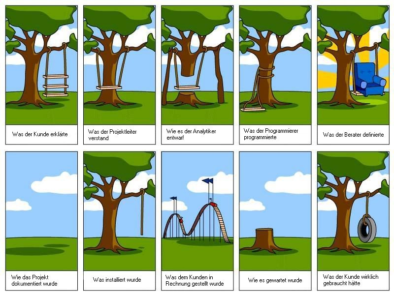

<!-- _class: cover -->

# Modul 431 
# <!--fit--> Woche 1

---

<!-- _class: big -->

# **Aufträge** im eigenen Berufsumfeld **selbstständig durchführen**

---

# Ablauf

## Lektionen **1 + 2**

- Kennenlernen
- Lernziele
- Modulübersicht
- Quartalsplan / LBs
- ePortfolio

## Lektionen **3 + 4**

- ePortfolio beginnen
- Handlungskompetenz
  - _erster ePortfolio Eintrag_
- Lernjournal

---

<!-- _class: big -->

# Kennenlernen
# <!--fit--> :accordion: :guitar: :climbing: :runner: :lotus_position: :family_man_woman_girl:  

---

# Lernziele :dart:

- Ich weiss, was mich im [Modul 431](https://codingluke.github.io/bbzbl-modul-431/docs/) erwartet

- Ich weiss in welchen Wochen es **welche Leistungsbewertungen** gibt
- Ich kenne die [Modulwebseite](https://codingluke.github.io/bbzbl-modul-431)
- Ich weiss, wo ich alle [Bewertungskriterien](https://codingluke.github.io/bbzbl-modul-431/docs/beurteilungen) der Abgaben nachschlagen kann
- Ich kann die [4 Kompetenzen der Handlungskompetenz](https://codingluke.github.io/bbzbl-modul-431/docs/themen/handlungskompetenz#4-kompetenzen) aufzählen
- Ich **weiss, was ein ePortfolio ist** und habe erste Notizen für mein ePortfolio festgehalten
- Ich habe den **ersten Lernjournal-Eintrag** geschrieben

---

---

# Modulübersicht 

- ePortfolio
- Handlungskompetenz
- Präsentationstechniken
- Kreativitätstechniken
- Projektmanagement
- Lernjournal

---

# Quartalsplan 1/2 

||Woche | Datum | Thema | LB
:---:|:---:|:---:|:---|:---
:point_right:|[Woche&nbsp;1](./woche-1.md) | 19.08.2022 | [ePortfolio](../themen/eportfolio.md) / [Handlungskompetenz](../themen/handlungskompetenz.md) / [Lernjournal](../themen/lernjournal.md) | 
||Woche&nbsp;2 | 26.08.2022 | IPERKA / Präsentationstechniken- und konzept | 
||Woche&nbsp;3 | 02.09.2022 | Tipps zur- und Erarbeitung der Präsentation | 
||Woche&nbsp;4 | 09.09.2022 | Kreativitäts-Techniken | 
||**Woche&nbsp;5** | **16.09.2022** | Projektmanagement Teil1 | [**LB1**](../beurteilungen/LB1.md) 

---

# Quartalsplan 2/2 

||Woche | Datum | Thema | LB
:---:|:---:|:---:|:---|:---
||Woche&nbsp;6 | 23.09.2022 | Projektmanagement Teil2 | 
||**Woche&nbsp;7** | **30.09.2022** | **Präsentationen / PM Test** | [**LB2**](../beurteilungen/LB2.md) Präsentation [**LB3**](../beurteilungen/LB3.md) Projektmanagement
 |||| _Herbstferien_ :roller_coaster: :ferris_wheel: | 
||Woche&nbsp;8 | 21.10.2022 | EPortfolio bearbeiten | 
||**Woche&nbsp;9** | **28.10.2022** | **ePortfolios Abgabe** | [**LB4**](../beurteilungen/LB4.md) Abgabe ePortfolio

---

# Leistungsbeurteilungen 

||Woche | Datum | Thema | LB
:---:|:---:|:---:|:---|:---
||**Woche&nbsp;5** | **16.09.2022** | Projektmanagement Teil1 | [**LB1**](../beurteilungen/LB1.md) Präsentationskonzept
||**Woche&nbsp;7** | **30.09.2022** | **Präsentationen / PM Test** | [**LB2**](../beurteilungen/LB2.md) Präsentation [**LB3**](../beurteilungen/LB3.md) Projektmanagement
||**Woche&nbsp;9** | **28.10.2022** | **ePortfolios Abgabe** | [**LB4**](../beurteilungen/LB4.md) Abgabe ePortfolio

---

# Weitere Präsentationen

- [ePortfolio](https://codingluke.github.io/bbzbl-modul-431/slides/eportfolio)
- [Handlungskompetenz](https://codingluke.github.io/bbzbl-modul-431/slides/handlungskompetenz)
- [Lernjournal](https://codingluke.github.io/bbzbl-modul-431/slides/lernjournal)
