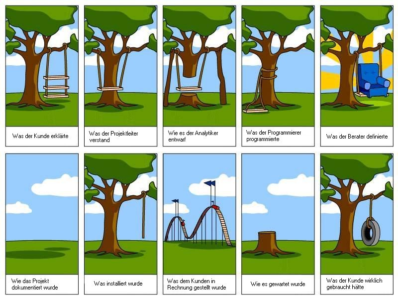

<!-- _class: cover -->

# Modul 431
# <!--fit--> Woche 1

---

<!-- _class: big -->

# **Aufträge** im eigenen Berufsumfeld **selbstständig durchführen**

---

# Ablauf

## Lektionen **1 + 2**

- Kennenlernen
- Lernziele
- Modulbeschrieb
- Quartalsplan
- Lernjournal

## Lektionen **3 + 4**

- Handlungskompetenz
- Arbeitsauftrag 1
- Arbeitsauftrag 2
- ePortfolio

---

<!-- _class: big -->

# Kennenlernen

---

# Lernziele :dart:

- Ich weiss, was mich im [Modul 431](https://codingluke.github.io/bbzbl-modul-431/docs/) erwartet

- Ich weiss in welchen Wochen es **welche Leistungsbewertungen** gibt
- Ich kenne die **[Modulwebseite](https://codingluke.github.io/bbzbl-modul-431)**
- Ich weiss, wo ich alle [Bewertungskriterien](https://codingluke.github.io/bbzbl-modul-431/docs/beurteilungen) der Abgaben nachschlagen kann
- Ich kann die [4 Kompetenzen der Handlungskompetenz](https://codingluke.github.io/bbzbl-modul-431/docs/themen/handlungskompetenz#4-kompetenzen) aufzählen
- Ich **weiss, was ein ePortfolio ist** und habe erste Notizen für mein ePortfolio festgehalten
- Ich habe den **ersten Lernjournal-Eintrag** geschrieben

---

---

# Modulthemen

- Lernjournal
- Handlungskompetenz
- ePortfolio
- Präsentationstechniken
- Kreativitätstechniken
- Projektmanagement
